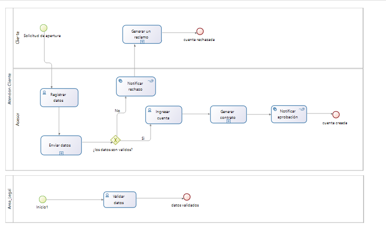
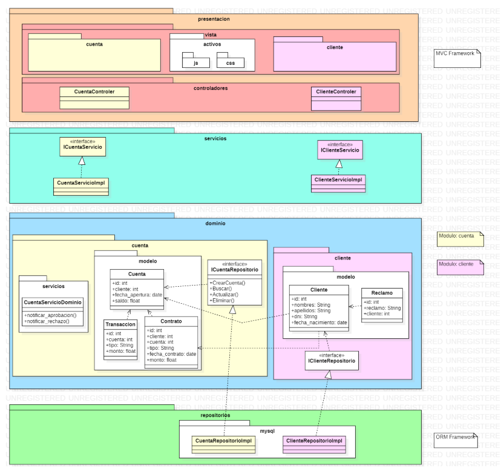
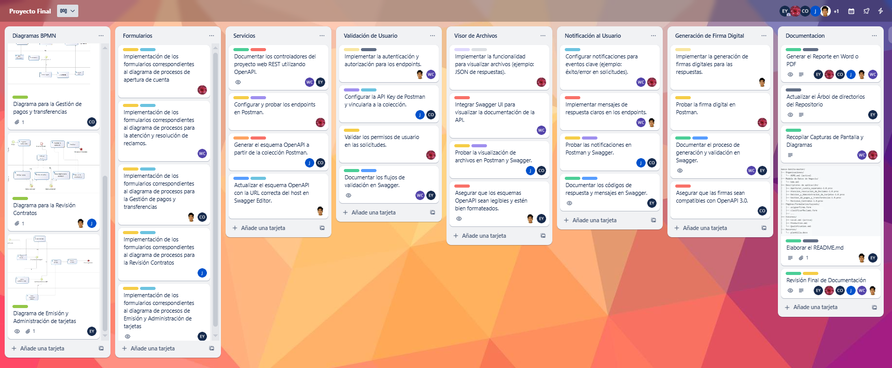

# **Proyecto Final**


**Miembros:**

-   Arleen Maritza Ferro Vasquez
-   Wilson Isaac Mamani Casilla
-   Jazmin Gabriela Perez Villasante
-   Cristhian David Huanca Olazabal
-   Sebastian Andres Mendoza Fernandez
-   Edilson Bonet Mamani Yucra

## Descripción General

Este proyecto modela y automatiza el proceso de **apertura de una cuenta bancaria** utilizando la herramienta **Bonita Studio**, siguiendo los principios de modelado BPMN (Business Process Model and Notation). Se basa en el funcionamiento real del **Banco de Crédito del Perú (BCP)** e incluye subsistemas clave como gestión de clientes, validación de datos, gestión de cuentas y notificaciones.

## Objetivo

Modelar seis procesos clave del BCP mediante diagramas BPMN que permitan:
- Representar gráficamente la estructura operativa.
- Identificar actores y flujos de información.
- Mejorar la eficiencia y trazabilidad del proceso de apertura de cuentas.

## Información de la Empresa

- **Nombre:** Banco de Crédito del Perú (BCP)  
- **Sitio Web:** [https://www.viabcp.com](https://www.viabcp.com)

### Misión
*Acompañar a nuestros clientes en su progreso, ofreciéndoles soluciones financieras simples, confiables y accesibles.*

### Visión
*Ser el banco más admirado del país por nuestra contribución al progreso de todos los peruanos.*

---

## Procesos Principales Modelados

### 1. **Apertura de cuenta**
- **Entrada:** Solicitud del cliente.
- **Proceso:** Registro → Validación → Aprobación o rechazo.
- **Salida:** Cuenta creada o notificación de rechazo.

### 2. **Solicitud de crédito**
- **Entrada:** Solicitud de préstamo.
- **Proceso:** Evaluación crediticia → Aprobación → Desembolso.
- **Salida:** Préstamo otorgado o rechazado.

---

## Dominio, Áreas Funcionales y Subsistemas

| Actividad             | Área Funcional   | Subsistema          |
|----------------------|------------------|---------------------|
| Registrar datos      | Área Comercial   | Gestión de Cliente  |
| Validar datos        | Área Legal       | Validación de Datos |
| Ingresar cuenta      | Contabilidad     | Gestión de Cuenta   |
| Generar contrato     | Contabilidad     | Gestión de Cuenta   |
| Notificar aprobación | Área Comercial   | Notificaciones      |
| Notificar rechazo    | Área Comercial   | Notificaciones      |
| Generar reclamo      | Área Comercial   | Gestión de Reclamos |

---

## Portafolio de Servicios

| Subsistema / Servicio     | Funcionalidades                         |
|---------------------------|------------------------------------------|
| Gestión de cuenta         | Crear, Actualizar cuenta                 |
| Gestión de cliente        | Crear, Buscar, Obtener cliente           |
| Validación de datos       | Validar cliente, contrato y reclamo      |
| Notificaciones            | Notificar aprobación o rechazo           |
| Gestión de reclamos       | Generar reclamo                          |

---

## Arquitectura UML (Vista General)

### Objetos de Negocio Modelados:

#### ClienteData
- `clienteId`, `nombres`, `apellidos`, `dni`, `fechaNacimiento`, `estaValidado`

#### ContratoData
- `contratoId`, `tipoContrato`, `solicitante`, `fechaContrato`, `monto`, `esValidoLegalmente`, `cumpleSBS`, `tieneFirma`, `estaAprobado`

#### CuentaData
- `cuentaId`, `cliente`, `fechaApertura`, `saldo`

#### ReclamoData
- `reclamoId`, `cliente`, `observacion`, `tipoReclamo`, `estaAceptado`
### Diagrama de proceso

### Arquitectura

---
## Arbol de directorios del Bontia Studio
```plaintext
banco-bonita-master/
├── Organizaciones/
│   └── ACME.xml (activa)
├── Modelo de Datos de Negocio/
│   ├── bdm.xml
├── Descriptores de aplicación/
├── Diagramas de proceso/
│   ├── Aperturar_cuenta_separados-1.0.proc
│   ├── Atencion_resolucion_de_Reclamos-1.0.proc
│   ├── Emision_y_Administracion_de_tarjetas-1.0.proc
│   ├── Gestion_de_pagos_y_transferencias-1.0.proc
│   └── Revision_Contratos-1.0.proc
├── Páginas/Formularios/Layouts/
│   ├── asignarFirma.form
│   ├── clasificarReclamo.form
│   ├── formNuevo.form
│   ├── generarReclamo.form
│   ├── ingresarCliente.form
│   ├── ingresarContrato.form
│   ├── ingresarCredito.form
│   ├── ingresarCuenta.form
│   ├── ingresarCuenta1.form
│   ├── ingresarCuenta2.form
│   ├── ingresarReclamo.form
│   ├── llenarObservacion.form
│   ├── mostrarContrato.form
│   ├── mostrarReclamo.form
│   ├── newForm.form
│   ├── newForm1.form
│   ├── newForm3.form
│   ├── resolverReclamo.form
│   ├── validarCliente.form
│   ├── validarLegalmenteContrato.form
│   ├── validarSBSContrato.form
│   └── BCP.page
├── Entornos/
│   ├── Local.xml (activa)
│   ├── Production.xml
│   └── Qualification.xml
├── Recursos/
│   └── plantilla.docx
```
## Comentarios Relevantes

- El proceso automatiza decisiones mediante validaciones internas antes de la aprobación.
- Es escalable y aplicable a canales presenciales o digitales.
- Se sugiere reforzar la autenticación mediante firma digital o verificación biométrica.

---

## Herramientas Utilizadas

- **Bonita Studio**: Modelado BPMN, diseño y automatización de procesos.
- **PlantUML** (opcional): Diagramas de arquitectura.

---
## Organización del Trabajo en Trello
A continuación, se presenta una imagen del tablero Trello que utilizamos para organizar y distribuir las actividades del proyecto. Cada miembro del equipo asumió responsabilidades específicas, abarcando desde el modelado de procesos BPMN hasta el diseño de formularios y la documentación final.

[Trello - Proyecto Final](https://trello.com/b/SV2T10sD/proyecto-final)

Esta planificación nos permitió trabajar de forma colaborativa y ordenada, asegurando que cada componente del sistema estuviera correctamente asignado, desarrollado y validado. El tablero refleja el flujo de trabajo real seguido por el equipo, agrupando las tareas por áreas como: diagramas de procesos, formularios, documentación, etc.

---
## Año

**Arequipa – Perú, 2025**
